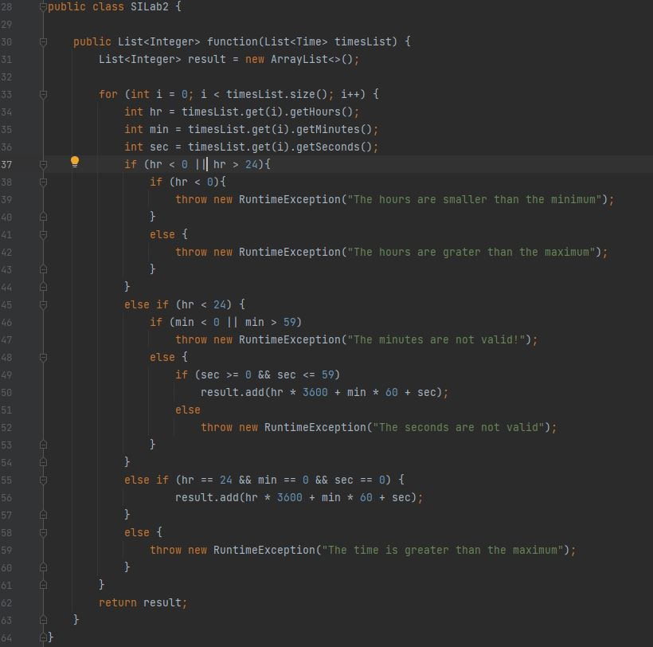

# Втора лабораториска вежба по Софтверско Инженерство 
## 1.Нацртав граф од овој код 
 
## 2.Control Flow графот за кодот погоре 
 
## 3. Цикломатската комплексност на графот е 8. Тоа го добив така што ги избројав сите региони во графот и испаднаа вкупно 8.
## 4. Според Multiple Condition критериумот сите тест случаи се следниве:
    • Во првиот If ако hr < 0 е точно а hr > 25 е неточно сепак ке пројде условот бидејќи е со || оператор и ќе влезе во Ifот.
     И да се случи обратното пак ќе влезе во Ifот. 
      • Откако влегува во Ifот наидува на друг If услов. 
        Ако во овој If hr < 0 е точно тогаш програмата фрла исклучок од тип RuntimeException со порака "The hours are smaller than the minimum".
          Но ако hr < 0 е грешно тогаш програмата фрла исклучок од тип RuntimeException со порака "The hours are greater than the maximum".
      Но ако и двата услова се грешни тогаш не влегува во Ifот и продолжува на следниот If.
    • Во вториот If или првиот else if се проверува условот hr < 24. Ако овој услов е точен тогаш се продолжува во овој else if.
      • Откако влегува во овој else if наидува на друг if. 
        Во овој If ако min < 0 е точно а min > 59 е грешно тогаш поминува условот. Истото се случува и во обратната ситуација.
        • Откако влегува во овој If програмата фрла исклучок од типот RuntimeException со порака "The minutes are not valid!".
          Ако двата услова min < 0 и min > 59  се грешни тогаш продолжува во else-от.
              • Откако влегува во else-от наидува на друг if услов.
          Ако во овој if условите sec >= 0 и sec <= 59 се точни тогаш во листата result се додава hr * 3600 + min * 60 + sec.
          Но ако барем еден од условите е грешен (а и двата ако се) програмата фрла исклучок од типот RuntimeException со порака "The seconds are not valid!".
           Ако условот h < 24 е грешен се продолжува на другиот else if.
    • Во третиот If или вториот else if се проверува условот hr == 24 и min == 0 и sec == 0. Ако овој услов е точен листата result додава hr * 3600 + min * 60 + sec.
      Ако условот е грешен се продолжува на else-от.
      Во овој else програмата фрла исклучок од типот RuntimeException со пораката "The time is greater than the maximum".
## 5. Според Every Branch критериумот сите тест случаи ќе се следниве:
 

